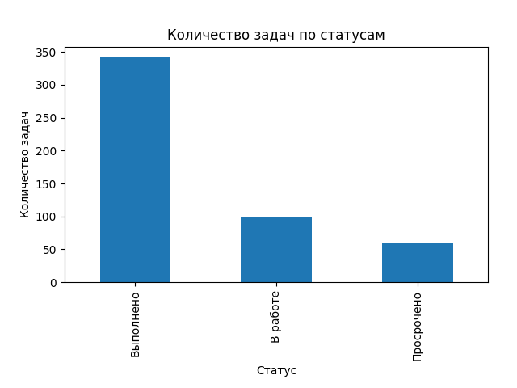
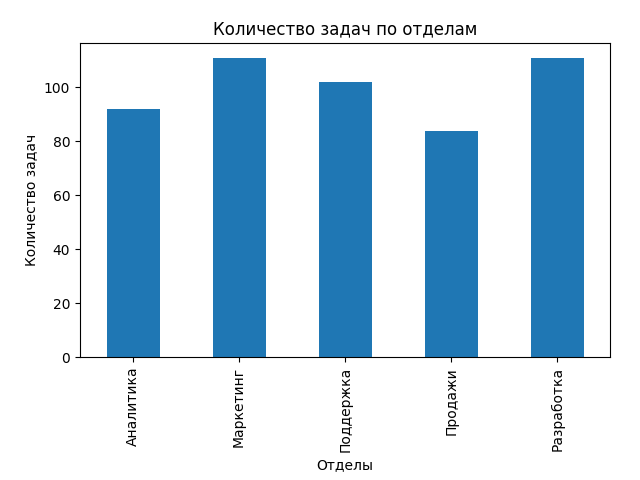
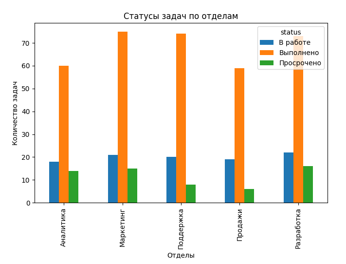
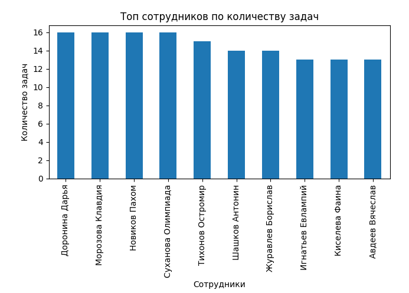

# Task Performance Dashboard

Проект для анализа производительности сотрудников с использованием Python, Pandas и Matplotlib.

## Описание

Проект генерирует тестовые данные о сотрудниках и их задачах, после чего выполняет анализ и визуализацию результатов.

В ходе анализа рассчитываются:

* количество задач по сотрудникам;
* количество задач по отделам;
* распределение статусов задач;
* основные показатели производительности.

## Используемые технологии

* Python 3.9
* Pandas
* Matplotlib

## Структура проекта

* `generate_data.py` — генерация тестовых данных;
* `analysis.py` — анализ и визуализация данных;
* `employees.csv` — данные сотрудников;
* `tasks.csv` — данные задач.

## Запуск проекта

1. Установить зависимости:

```bash
pip install -r requirements.txt
```

2. Сгенерировать данные:

```bash
python generate_data.py
```

3. Запустить анализ:

```bash
python analysis.py
```

## Результат

Проект демонстрирует базовые навыки работы с:

* Pandas (merge, groupby, pivot table);
* обработкой данных;
* построением графиков;
* использованием Git и GitHub.

## Dashboard Preview

### Task Status Distribution



### Tasks by Department



### Task Status by Department



### Top Employees by Number of Tasks

