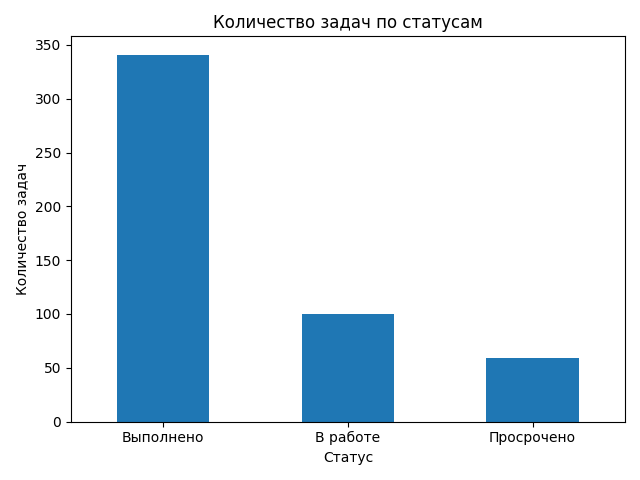
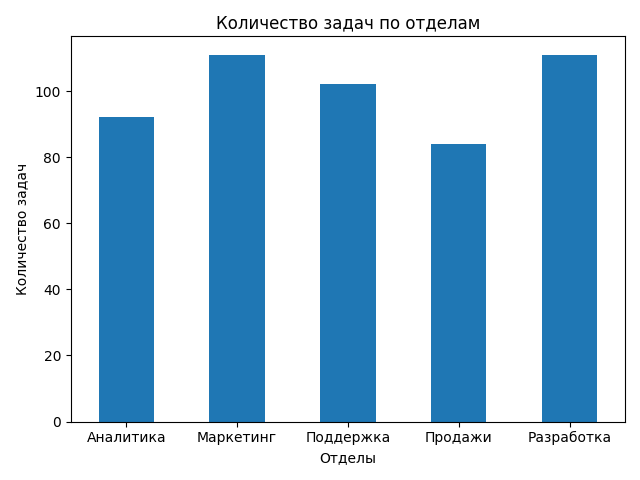
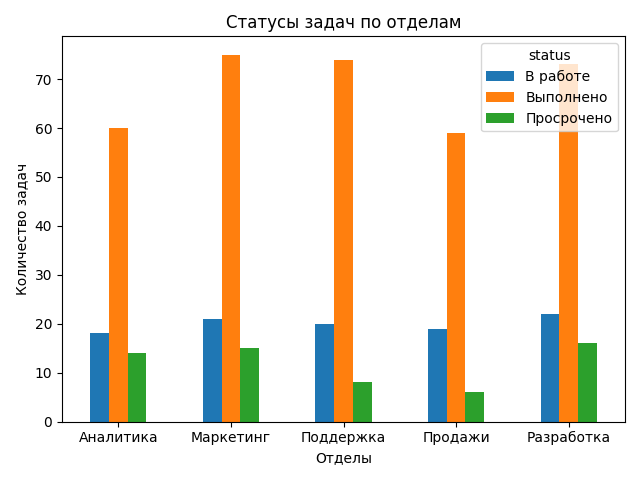
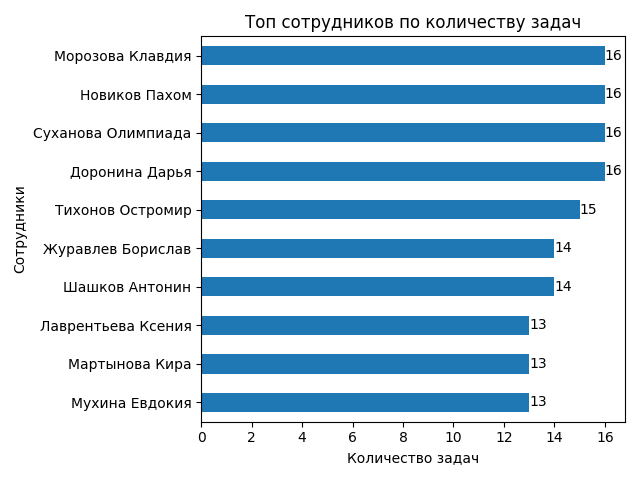
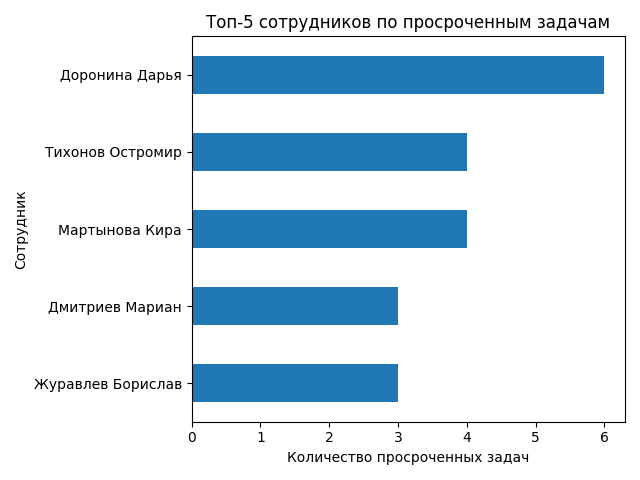
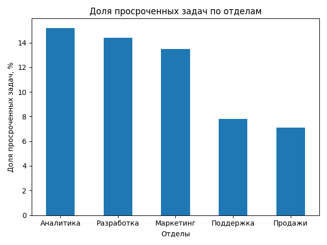

# Task Performance Dashboard

Учебный аналитический проект для анализа производительности сотрудников, загрузки и обработки данных, расчёта метрик и визуализации результатов с использованием Python, Pandas и Matplotlib.

## Описание

Проект генерирует тестовые данные о сотрудниках и их задачах, после чего выполняет анализ и визуализацию результатов.

В ходе анализа рассчитываются:

* количество задач по сотрудникам;
* количество задач по отделам;
* распределение статусов задач по отделам;
* топ сотрудников по количеству задач;
* топ сотрудников по количеству просроченных задач;
* количество просроченных задач по отделам;
* доля просроченных задач по отделам;
* рейтинг отделов по доле просроченных задач.

## Используемые технологии

* Python 3.9
* Pandas
* Matplotlib

## Структура проекта

- `generate_data.py` - генерация тестовых данных;
- `analysis.py` - анализ и визуализация данных;
- `employees.csv` - данные сотрудников;
- `tasks.csv` - данные задач;
- `requirements.txt` - зависимости проекта;
- `screenshots/` - изображения графиков.

## Запуск проекта

1. Установить зависимости:

```bash
pip install -r requirements.txt
```

2. Сгенерировать данные:

```bash
python generate_data.py
```

3. Запустить анализ:

```bash
python analysis.py
```

## Результат

Проект демонстрирует навыки работы с:

* Pandas (`merge`, `groupby`, `value_counts`, `unstack`, сортировка и фильтрация данных);
* расчётом агрегированных показателей;
* анализом абсолютных и относительных метрик;
* Matplotlib и построением столбчатых диаграмм;
* генерацией тестовых данных;
* Git и GitHub.

## Основные выводы

* Наибольшее абсолютное количество просроченных задач приходится на отдел разработки - 16.
* Самая высокая доля просроченных задач наблюдается в отделе аналитики - 15.2%.
* Это показывает, что абсолютное количество просрочек и их доля от общей нагрузки могут давать разную оценку эффективности отдела.

## Dashboard Preview

### Task Status Distribution



### Tasks by Department



### Task Status by Department



### Top Employees by Number of Tasks



### Top 5 Employees by Overdue Tasks



### Overdue Task Rate by Department

